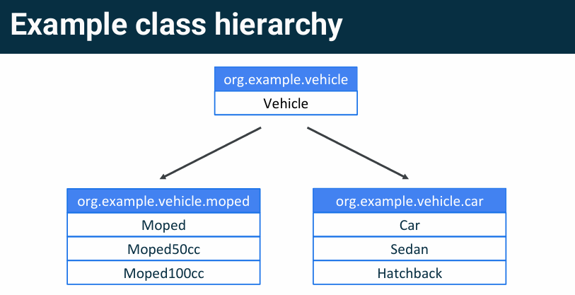

# Lesson 3 - Classes and Objects

## Class

### Define and use a class

Class Definition

    class House {
        val color: String = "White"
        val numberOfWindows: Int = 2
        val isForSale: Boolean = false

        fun updateColor(newColor: String) {...}
    }

Create New Object Instance

    val myHouse = House()
    println(myHouse)

### Constructors

When a constructor is defined in the class header, it can contain

- No parameters

        class A

- Parameters

    - Not marked with `var` or `val` - Exists only within scope of the constructor

            class B(x: Int)

            val bb = B(12)
            println(bb.x) // error, can not access
    
    - Marked `var` or `val` - Exists in all instances of the class

            class C(val y: Int)
            
            val cc = C(42)
            println(cc.y) // 42

Class instances can have default values

    class Box(val length: Int, val width: Int = 20, val height: Int = 40)
    val box1 = Box(100, 20, 40)
    val box2 = Box(length = 100)
    val box3 = Box(length = 100, width = 20, height = 40)

**Primary Constructor**

    class Circle(i: Int) {
        init {
            ...
        }
    }

    class Circle {
        constructor(i: Int) {
            ...
        }
    }

**Initializer Block**

- Any required initialization code is run in a special `init` block
- Multiple `init` blocks are allowed
- `init` blocks become the body of the primary constructor

        class Square(val side: Int) {
            init {
                println(side * 2)
            }
        }
        val s = Square(10) // 20

**Multiple constructors**

- Use the `constructor` keyword to define secondary constructors
- Secondary constructors must call the primary constructor using `this` keyword or another secondary constructor that calls the primary constructor
    > Đảm bảo init luôn được thực hiện
- Secondary constructor body is not required

        class Circle(val radius: Double) {
            constructor(name: String) : this(1.0)
            constructor(diameter: Int) : this(diameter / 2.0) {
                println("In diameter constructor")
            }

            init {
                println("Area: ${Math/PI * radius * radius}")
            }
        }

        val c = Circle(3)
        val cc = Circle("DoDat") // will have radius = 1.0

### Properties

- Define properties in a class using `val` or `var`
- Access these properties using dot `.` notation with property name

        class Person(var name: String)

        fun main() {
            val person = Person("Alex")
            println(person.name)
            person.name = "Joey" // work with var
            println(person.name)
        }

### Custom getters and setters

    class Person(private var firstName: String, private var lastName: String) {
        var fullName: String = ""
            get() = "$firstName $lastName"
            set(value) {
                val components = value.split(" ")
                firstName = components[0]
                lastName = components[1]
                field = value // nếu init có = "" thì phải có field ở đây
            }
    }

    fun main() {
        val person = Person("John", "Doe")
        println(person.fullName)
        person.fullName = "Do Dat"
        println(person.fullName)
    }

## Inheritance

- Kotlin has single-parent class inheritance
- Each class has exactly one parent class, called a superclass
- Each subclass inherits all members of its superclass including ones that the superclass itself has inherited

### Interfaces

- Provide a contract all implementing classes must adhere to
- Can contain method signatures and property names
- Can derive from other interfaces

```
interface Shape {
    fun computeArea(): Double
}

class Circle(val radius: Double) : Shape {
    override fun computeArea(): Double = radius * radius * Math.PI
}

fun main() {
    val c = Circle(3.0)
    println("Radius: ${c.radius}")
    println("Area: ${c.computeArea()}")
}
```

### Extending classes

- Kotlin classes by default (`final`) are not subclassable (Use `open` keyword to declare a class so that it can be subclassed)

- Use `open` keyword to allow subclassing

- Properties and functions are redefined with the `override` keyword (Must use `open` for properties and methods that can be overridden, otherwise you get compiler error)

- Something marked `override` can be overridden in subclasses (unless marked `final`)

```
open class Animal {
    open val type: String = "Animal"
    open fun sound() { println("sound") }
    open fun eat() { println("eat") }
}

open class Dog : Animal() {
    override val type = "Dog"
    override fun sound() { println("Woof!") }
    final override fun eat() { println("dog eat!") }
}

class Bulldog : Dog() {
    override val type = "Bulldog"
    override fun sound() { println("Bull!") }
    // override fun eat() {} - final so can not override
}

fun main() {
    val bulldog = Bulldog()
    bulldog.sound()
    bulldog.eat()
}
```

### Abstract Classes

- Class is marked as `abstract`
- Cannot be instantiated, must be subclassed 
- Similar to an interface with the added the ability to store state 
- Properties and functions marked with `abstract` must be overridden 
- Can include non-abstract properties and functions

```
abstractclassFood {
    abstract valkcal : Int
    abstract valname : String
    fun consume() = println("I'm eating ${name}")
}

classPizza() : Food() {
    override val kcal = 600
    override val name = "Pizza"
}

funmain() {
    Pizza().consume()
}
```

### Use cases

- Defining a broad spectrum of behavior or types? Consider an interface
- Will the behavior be specific to that type? Consider a class
- Need to inherit from multiple classes? Consider refactoring code to see if some behavior can be isolated into an interface
- Want to leave some properties / methods abstract to be defined by subclasses? Consider an abstract class
- You can extend only one class, but implement one or more interfaces

## Extension functions

Add functions to an existing class that you cannot modify directly

- Add functionality to classes that are not open
- Add functionality to classes you don’t own 
- Separate out core API from helper methods for classes you own

```
fun Int.isOdd(): Boolean { return this % 2 != 0 }
fun main() {
    val num: Int = 10
    println(num.isOdd())
    println(3.isOdd())
}
```

## Special classes

### Data class

- Special class that exists just to store a set of data
- Mark the class with the `data` keyword
- Generates getters for each property (and setters for var too)
- Generates `toString()`, `equals()`, `hashCode()`, `copy()` methods, and destructuring operators

```
data class Player(val name: String, val score: Int)
val firstPlayer = Player("Lauren", 10)
```

**Pair and Triple** - Access variables with `.first`, `.second`, `.third` respectively

    val bookAuthor = Pair("Harry Potter", "J.K. Rowling")
    val bookAuthrorYear = Triple("Harry Potter", "J.K. Rowling", 1997)

    println(bookAuthorYear.third)

**Pair to**

    valbookAuth1 = "Harry Potter".to("J. K. Rowling")
    valbookAuth2 = "Harry Potter"to"J. K. Rowling"
    => bookAuth1 and bookAuth2 are Pair (Harry Potter, J. K. Rowling)

**Map** - Like dictionary

    val countriesCapital = mapOf(
        "Vietnam" to "Hanoi", // pair
        "Japan" to "Tokyo",
        "France" to "Paris"
    )

    fun main() {
        val capitalOfVietnam = countriesCapital["Vietnam"] 
        println(capitalOfVietnam)
    }

### Enum class

User-defined data type for a set of named values
- Use `this` to require instances be one of several constant values 
- The constant value is, by default, not visible to you 
- Use `enum` before the `class` keyword

```
enum class Color(val r: Int, val g: Int, val b: Int) {
    RED(255, 0, 0), GREEN(0, 255, 0), BLUE(0, 0, 255)
}
println(""+ Color.RED.r + " "+ Color.RED.g + " "+ Color.RED.b)
// 255 0 0
```

### Object/singleton

- Sometimes you only want one instance of a class to ever exist 
- Use the objectkeyword instead of the classkeyword
- Accessed with `NameOfObject.<function or variable>`

```
object Calculator {
    fun add(n1: Int, n2: Int): Int {
        returnn1 + n2
    }
}
println(Calculator.add(2,4))
```

### Companion Objects

Companion Object trong Kotlin là một khái niệm đặc biệt, giúp bạn tạo các thành viên thuộc lớp (được gọi là "companion members") mà không cần tạo một đối tượng riêng biệt của lớp đó

- Lets all instances of a class share a single instance of a set of variables or functions 
- Use companionkeyword
- Referenced via ClassName.PropertyOrFunction

```
class PhysicsSystem {
    companion object WorldConstants {
        val gravity = 9.8
        val unit = "metric"
        fun computeForce(mass: Double, accel: Double): Double {
            return mass * accel
        }
    }
}

println(PhysicsSystem.WorldConstants.gravity)
println(PhysicsSystem.WorldConstants.computeForce(10.0, 10.0))
```

## Organizing your code

### Single file, multiple entities

- Kotlin DOES NOT enforce a single entity (class/interface) per file convention
- You can and should group related structures in the same file
- Be mindful of file length and clutter

### Packages

- Provide means for organization
- Identifiers are generally lower case words separated by periods
- Declared in the first non-comment line of code in a file following the `package` keyword
    `package org.example.game`



### Visibility modifiers

Use visibility modifiers to limit what information you expose.
- `public` means visible outside the class. Everything is public by default, including variables and methods of the class
- `private` means it will only be visible in that class (or source file if you are working with functions)
- `protected` is the same as `private`, but it will also be visible to any subclasses
