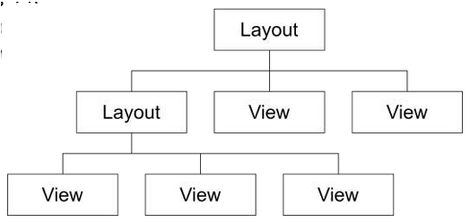
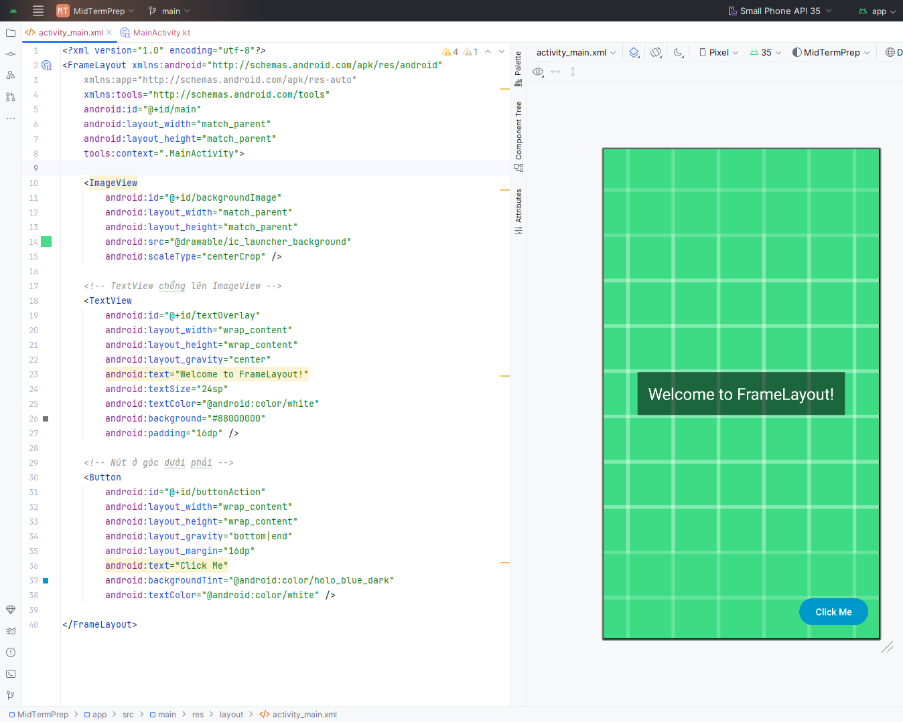
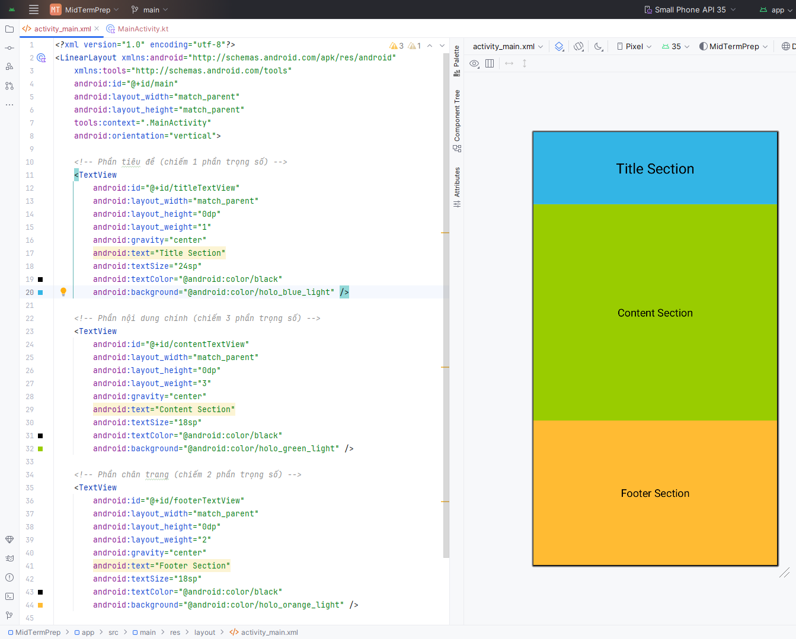
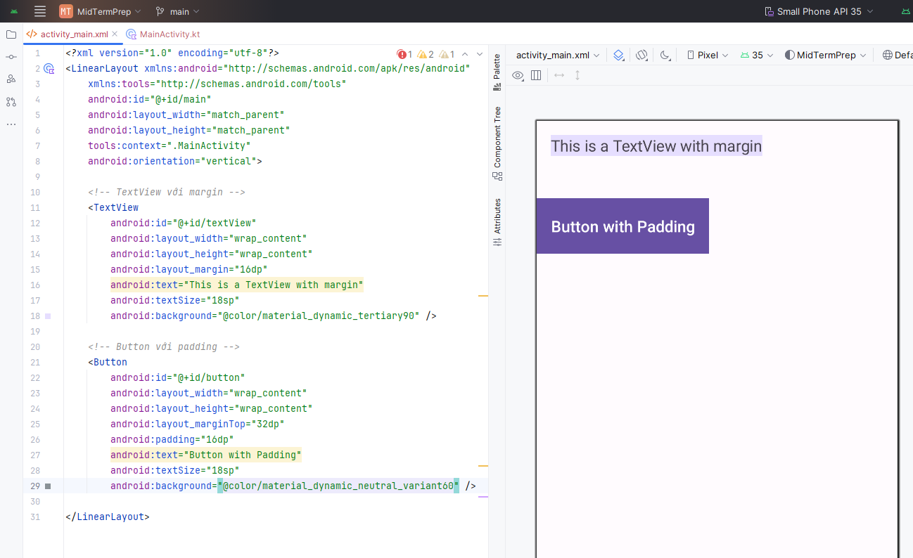
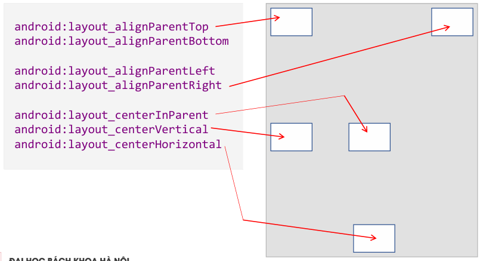
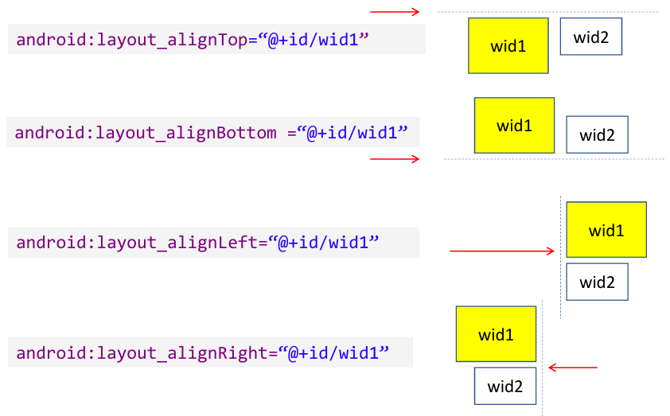
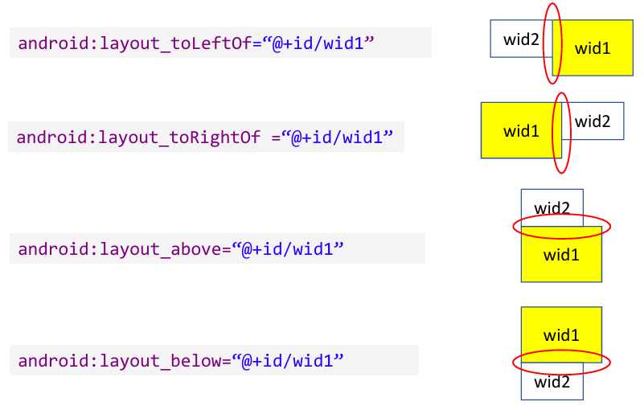
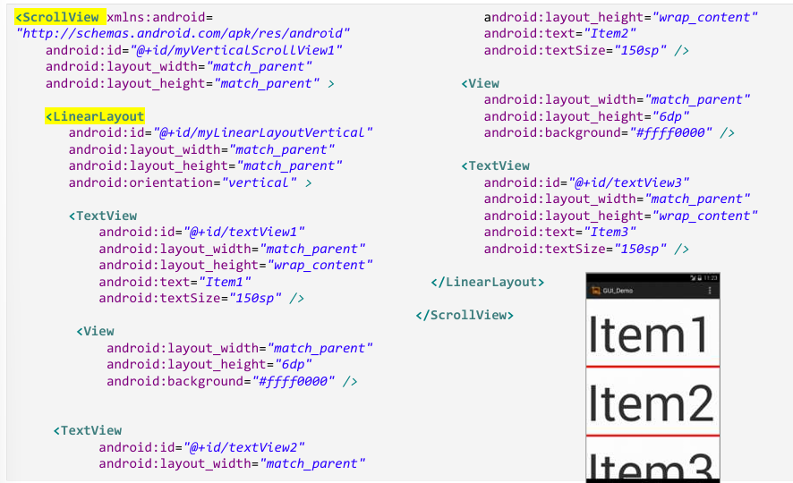
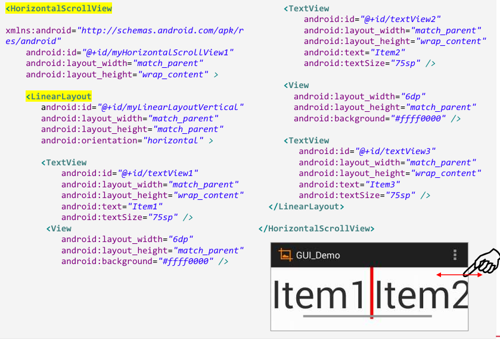
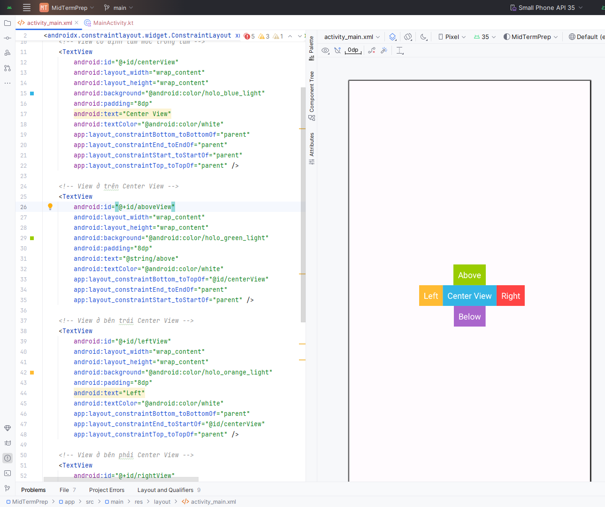

# GUI - Basic widgets (1)

## The View class

- The View class is the Android’s most basic component from which user interfaces can be created. It acts as a container of displayable elements
- A View occupies a rectangular area on the screen and is responsible for drawing and event handling 
- Widgets are subclasses of View. They are used to create interactive UI components such as buttons, checkboxes, labels, text fields, etc. 
- Layouts are invisible structured containers used for holding other Views and nested layouts. 

### Nesting XML Layouts

- An Android’s XML view file consists of a layout design holding a hierarchical arrangement of its contained elements 
- The  inner elements could be basic widgets or user-defined nested layouts holding their own viewgroups
- An Activity uses the `setContentView(R.layout.xmlfilename)` method to render a  view on the device’s screen

### Setting Views to Work

Dealing with widgets & layouts typically involves the following operations

- Set properties:  For instance, when working with a TextView you set the background color, text, font, alignment,  size, padding,  marging, etc.
- Set up listeners: For example, an image could be programmed to respond to various events such as: click, long-tap, mouseover, etc.

## The Layout

### FrameLayout

- The FrameLayout is the simplest type of GUI container.
- It is useful as an outermost container holding a window.
- Allows you to define how much of the screen (high, width) is to be used.
- All its children elements are aligned to the top left corner of the screen

### LinearLayout

- The LinearLayout supports a filling strategy in which new elements are stacked either in a **horizontal** or **vertical** fashion
- If the layout has a vertical orientation new rows are placed one on top of 
the other
- A horizontal layout uses a side-by-side column placement policy

**Attributes**

| Attribute     | Value                         |
|---------------|-------------------------------|
| orientation   | vertical, horizontal          |
| fill model    | match_parent, wrap_contents   |
| weight        | 0, 1, 2, ..., n               |
| gravity       | top, bottom, center           |
| padding       | dp - dev. independent pixels  |
| margin        | dp - dev. independent pixels  |

**LinearLayout: Fill model**

All widgets inside a LinearLayout **must** include `android:layout_width` and `android:layout_height` attributes. Values can be:

- A specific dimension such as 125dp (devide independent pixels dip)
- `wrap_content` indicates the widget should just fill up its natural space
- `match_parent` (previous version: `fill_parent`) indicates the widget wants to be as big as the enclosing parent

**LinearLayout: Weight**

The extra space left unclaimed in a layout could be assigned to any of its inner components by setting its Weight attribute. Use 0 if the view should not be stretched. The bigger the weight the larger the extra space given to that widget. 

**LinearLayout: Gravity**

Gravity is used to indicate how a control will align on the screen
> Default: left and top align

Other possible arrangements: `top`, `bottom`, `left`, `right`, `center_vertical`, `fill_vertical`, `center_horizontal`, `fill_horizontal`, `center`, `fill`, `clip_vertical` (Nội dung bị cắt hoặc giới hạn theo chiều dọc nếu nó vượt quá vùng chứa), `clip_horizontal`, `start` (Căn nội dung vào mép bắt đầu theo hướng ngôn ngữ, Tiếng Anh: Bên trái, Tiếng Ả Rập: Bên phải), `end`

Multiple values: `android:layout_gravity="end|bottom"`

**LinearLayout: Margin and Padding**

### Relative Layout

The placement of a widget in a RelativeLayout is based on its positional relationship to other widgets in the container as well as the parent container

### ScrollView Layout

- ScrollViews provide a vertical sliding (up/down) access to the data
- The HorizontalScrollView provides a similar left/right sliding mechanism

### Constraint Layout

Deeply nested layouts are costly
- Deeply nested ViewGroups require more computation
- Views may be measured multiple times
- Can cause UI slowdown and lack of responsiveness
Use ConstraintLayout to avoid some of these issues

ConstraintLayout:
- Recommended default layout for Android 
- Solves costly issue of too many nested layouts, while allowing complex behavior 
- Position and size views within it using a set of constraints

