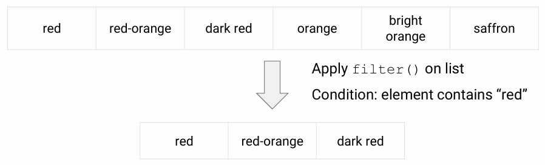

# Lesson 1 - Kotlin basics

## Operators

| Operators                         | Symbols             |
|-----------------------------------|---------------------|
| Mathematical operators            | `+` `-` `*` `/` `%` |
| Increment and decrement operators | `++` `--`           |
| Comparison operators              | `<` `<=` `>` `>=`   |
| Assignment operator               | `=`                 |
| Equality operators                | `==` `!=`           |

**Numeric operator methods**: Kotlin keeps numbers as primitives, but lets you call methods on numbers as if they were objects

    2.times(3)
    => kotlin.Int = 6

## Data types

- Integer types: `Long`, `Int`, `Short`, `Byte`
    - Underscores for long numbers

            val oneMillion = 1_000_000

- Floating-point and other numeric types: `Double`, `Float`, `Char`, `Boolean`

- Strings - any sequence of characters enclosed by double quotes or any arbitrary text delimited by a triple quote (`"""`)

        val s1 = "Hello World!"

        val text = """
            var bikes = 50
        """

### Type casting

Convert `Int` to `Byte`

    val i: Int = 6
    println(t.toByte())

### String concatenation and templates

    val numberOfDogs = 3
    val numberOfCats = 2

    print("I have $numberOfDogs dogs" + " and $numberOfCats cats")

    val s = "abc"
    println("$s.length is ${s.length}")

## Variables

Kotlin is a statically-typed language. The type is resolved at compile time and never changes

- The compiler infer the type or you can explicitly declare the type if needed

        var width = 12
        var width: Int = 12

- Mutable and immutable variables (recommended)

        // mutable (changeable)
        var score = 10
        // immutable (unchangeable)
        val name = "Jennifer"

> `val` cannot be reassigned

## Conditionals

### if/else statements

    val guests = 30
    if (guests == 0) {
        println("No guests")
    } else if (guests < 20) {
        println("Small group of people)
    } else {
        println("Large group of people)
    }

### Ranges

    val numberOfStudents = 50
    if (numberOfStudents in 1..100) {
        println(numberOfStudents)
    }

### when statement - like switch_case

    when (results) {
        0 -> println("No results")
        in 1..39 -> println("Got results!")
        else -> println("That's lot of results!")
    }

## Loops

### for loops

    val pets = arrayOf("dog", "cat", "canary")
    for (element in pets) {
        print(element + " ")
    }

    for ((index, element) in pets.withIndex()) {
        println("Item at $index is $element\n")
    }

    for (i in 1..5)         // 12345
    for (i in 5 downTo 1)   // 54321
    for (i in 3..6 step 2)  // 3 5
    for (i in 'd'..'g')     // defg

### while loops

    var bicycles = 0
    while (bicycles < 50) {
        bicycles++
    }

    do {
        bicycles--
    } while (bicycles> 50)

### repeat loops

    repeat(2) {
        print("Hello")
    }

## Lists and Arrays

### Lists

- Lists are ordered collection of elements, can be accessed programmatically through their indices
- Elements can occur **more than once** in a list

**Immutable list using listOf() - can not add, remove, edit elements**

    val instruments = listOf("trumpet", "piano", "violin")
    // [trumpet, piano, violin]

**Mutable list using mutableListOf()**

    val myList = mutableListOf("trumpet", "piano", "violin")
    myList.remove("violin") // return Boolean

**Set data types**

    val list1 = mutableListOf<Int>()
    val list2 = listOf<String>()

### Arrays

- Arrays store multiple items
- Arrays elements can be accessed programmatically through their indices
- Array elements are **mutable**
- Array size is **fixed**

**Array defining examples**

    val pets = arrayOf("dog", "cat", "canary")

    // differents types
    val mix = arrayOf("hats", 2)

    // one type
    val numbers = intArrayOf(1, 2, 3)

**Combining arrays - Using `+` Operator**

    val num1 = intArrayOf(1, 2, 3)
    val num2 = intArrayOf(4, 5, 6)
    val combined = num1 + num2

## Null safety

- In Kotlin, variables cannot be `null` by default

        var numberOfBooks: Int = null // error

- You can explicitly assign a variable to `null` using the safe call (`?`) operator

        var numberOfBooks: Int? = null // Int? as nullable

- Allow null-pointer exceptions using the `!!` operator. `!!` forces the variable into a non-null type

        var len = s!!.length
        // throws NullPointerException if s is null

- You can test for null using the elvis (`?:`) operator

        var numberOfBooks = 6
        if (numberOfBooks != null) {
            numberOfBooks = numberOfBooks.dec()
        } else {
            numberOfBooks = 0
        }

        // or
        numberOfBooks = numberOfBooks?.dec() ?: 0

# Lesson 2 - Functions

## Create a main() function

`main()` is the entry point foe execution for a Kotlin progrem

    fun main(args: Array<String>) {
        println("Hello, world!")

        // if have arguments
        println("Hello, ${args[0]}")
    }

> The args in the main() function are optional

## Everything is an expression and has a value

    val temperature = 20
    val isHot = if (temperature > 40) true else false
    println(isHot)
    => false

Sometimes, that value is `kotlin.Unit`

    val isUnit = println("This is an expression") // println return an unit object
    println(isUnit)
    => This is an expression
       kotlin.Unit

## Functions in Kotlin

- Declared using the `fun` keyword
- Can take arguments with either named or default values

### Unit returning functions

If a function does not return any useful value, its return type is `Unit`

    // Writing :Unit is optional 
    fun printHello(name: String?): Unit {
        println("Hi there!")
    }

> `Unit` is a type with only one value `Unit`

### Function arguments

Functions may have
- Default parameters
- Required parameters
- Named arguments

**Default parameters** provide a fallback if no parameter value is passed

    fun drive(speed: String = "fast") {
        println("driving $speed")
    }
    drive() ⇒driving fast
    drive("slow") ⇒driving slowly
    drive(speed = "turtle-like") ⇒driving turtle-like

**Required parameters** 

If no default is specified for a parameter, the corresponding argument is required

    fun tempToday(day: String, temp: Int) {
        println("Today is $day and it's $temp degrees")
    }

**Default versus required parameters**

Functions can have a mix of default and required parameters

    fun reformat(str: String, 
                 divideByCamelHumps: Boolean, 
                 wordSeparator: Char, 
                 normalizeCase: Boolean = true) {  }
    reformat("Today is a day like no other day", false, '_')

### Compact functions

Compact functions, or single-expression functions, make your code more concise and readable

    fun double(x: Int): Int {
        x * 2
    }

    fun double(x: Int): Int = x * 2

### Lambdas and higher-order functions

- Kotlin functions can be stored in variables and data structures
- They can be passed as arguments to, and returned from, other higher-order functions
- You can use higher-order functions to create new "built-in" functions

**Lambda functions** - an expression that makes a function that has no names

    var dirtLevel = 20
    val waterFilter = { level: Int -> level / 2 }
    // { parameter_and_type -> code_to_execute }
    println(waterFilter(dirtLevel))

**Syntax for function types** - closely related to its syntax for lambdas. Declare a variable that holds a function

    val waterFilter: (Int) -> Int = { level -> level / 2 }
    val filteredLevel = waterFilter(20)

**Higher-order functions** - take functions as parameters, or return a function

    fun encodeMsg(msg: String, encode: (String) -> String): String {
        return encode(msg)
    }

The body of the code calls the function that was passed as the second argument, and passes the first argument along to it.

    val enc1: (String) -> String = { input -> input.toUpperCase() }
    println(encodeMsg("abc", enc1))

**Pasing a function reference** - Use the `::` operator to pass a named function as an argument to another function

    fun enc2(input: String): String = input.reversed() // declared using fun
    encodeMessage("abc", ::enc2)

The ::operator lets Kotlin know that you are passing the function reference as an argument, and not trying to call the function.

> Kotlin prefers that any parameter that takes a function is the last parameter

    encodeMessage("acronym", { input -> input.toUpperCase() })
    // both work
    encodeMsg("acronym") { input -> input.toUpperCase() }

Many Kotlin built-in functions are defined using last parameter call syntax

    inline funrepeat(times: Int, action: (Int) -> Unit)
    repeat(3) {
        println("Hello")
    }

## List filters

### Iterating through lists

If a function literal has only one parameter, you can omit its declaration and the "->". The parameter is implicitly declared under the name `it`.

    val ints = listOf(1, 2, 3)
    ints.filter { it > 0 }

    // equivalent to
    ints.filter { n: Int -> n > 0 }
    ints.filter { n -> n > 0}

If the expression in curly braces `{ }` returns `true`, the item is included

    valbooks = listOf("nature", "biology","birds")
    println(books.filter { it[0] == 'b' })
    => [biology, birds]

### Eager filters

**Eager** - occurs regardless of whether the result is ever used

Filters are eager by default. A new list is created each time you use a filter

    valinstruments = listOf("viola", "cello", "violin")
    valeager = instruments.filter { it [0] == 'v'}
    println("eager: " + eager)
    => eager: [viola, violin]

### Lazy filters

**Lazy** - occurs only if necessary at runtime

Sequences are data structures that use lazy evaluation, and can be used with filters to make them lazy.

    valinstruments = listOf("viola", "cello", "violin")
    valfiltered = instruments.asSequence().filter { it[0] == 'v'}
    println("filtered: "+ filtered)
    => filtered: kotlin.sequences.FilteringSequence@386cc1c4

Sequences can be turned back into lists using `toList()`.

    valfiltered = instruments.asSequence().filter { it[0] == 'v'}
    valnewList = filtered.toList()
    println("new list: " + newList)
    => new list: [viola, violin]

## Other list transformations

- `map()` performs the same transform on every item and returns the list

        val numbers = setOf(1, 2, 3) // no dup, immutable
        println(numbers.map { it * 3 })
        => [3, 6, 9]

- `flatten()` returns a single list of all the elements of nested collections

        valnumberSets = listOf(setOf(1, 2, 3), setOf(4, 5), setOf(1, 2))
        println(numberSets.flatten())
        => [1, 2, 3, 4, 5, 1, 2]
